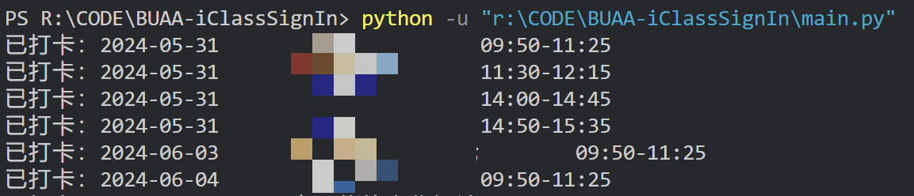

# BUAA-iClassSignIn
远程智慧教室打卡

仅作为代码学习交流用，请不要用我的代码做不好的事🥰

虽然代码逻辑写的是一次打完所有课，但建议接近上课时间再运行代码以防打卡时间太怪被判定无效   
在小程序的课表查询里显示为“多节课”的课程无法通过这个仓库打卡       

## 使用方法

建议先尝试`main.py`：   
在`student_id`里填自己的学号，当然别人的学号也不是不行（   
运行`main.py`即可进行打卡。   

如果`main.py`无法正常使用，请使用`password_ver.py`，在文件开头的`stu_id`填入学号，`stu_pwd`填入统一认证密码，然后运行`password_ver.py`

控制台会输出打卡进度：

## 一些更新日志

### 26.1.5
按照评论区说的方法更新了端口。（不包括GUI版）           

### 25.10.22
感谢[这位同学](https://github.com/Ever-m1ss)新增的功能。~~我不怎么会用git，到处乱点把pr接收了，但是我写的commit message现在看起来像他写的了，太尴尬了。~~             

使用tkinter库做了GUI界面

对代码逻辑做了以下改动：

  1.修改了原代码一键打满本学期所有课程的运行逻辑。为提高签到的成功率和安全性（主要是安全性🥰），将签到功能改为实时签到（在课程开始前10分钟至课程结束可签到）

  2.添加“查询本学期签到情况“功能，可以迅速查询截至查询当天本学期未签到的课程，并且可以选择对指定的 课程进行补签（风险未知，请自行评估风险再决定是否使用😉）

将所有文件打包成exe文件，使程序的执行不再依赖python环境和第三方库的安装

### 25.4.4
如前两天更新所说，登录接口的加强并没有影响原来那个接口的正常使用，因此正常用`main.py`就可以了，但姑且写了一个**使用账号密码登录**的版本，如果仅用学号登录的接口失效，这个版本应该能顶上。   

### 25.4.2
众所周知因为被举报了所以网页做出了部分调整，但截至这次readme更新，网站实际上的加强似乎只是把登录接口换成了一个需要更多验证的接口，而以前的登录接口还能正常运行，也就是说目前这个仓库是能完全正常运行的。    
如果你发现用不了了&&有一定代码能力&&想接着用的话可以阅读后续内容。

#### 原理
~~众所周知~~，智慧教室扫码签到的原理是用自己登陆后的账号向签到链接（这个签到链接包含课程id和时间戳两个参数，课程id顾名思义是用来区分给哪节课签到的，时间戳则是签到二维码会不停变化的原因）发请求，请求把账号信息一起发过去从而实现签到人身份的识别

那么这个仓库的代码做了什么呢？

+ 通过`login`获取唯一确定学生身份的`userId`，在后续查询课表和签到里，这个参数用来识别用户。此外登陆会产生`sessionId`，这个被ban了我就不知道怎么办了（
+ 通过`get_stu_course_sched`查询课表，这个请求返回唯一确定一堂课的`courseSchedId`，在签到里，这个参数用来识别节次。
+ 通过`stu_scan_sign`真正进行签到。用`userId`、`courseSchedId`、`timestamp`几个参数get了一下签到请求，这一步和手机扫码的行为是一样的。

以上，代码修改可以参考这些内容。   

## 替代方案

如果这个仓库已经完全失效了，~~考虑到我写这个的时候其实就已经没什么课了并且马上就离开aubb了所以肯定是不会维护仓库了~~，简单分享两个替代方案：

1. 扫码签到的二维码其实是一个链接，想要扫描二维码就是访问这个链接。最自然的想法应该是自己复刻一个二维码出来，然后拿着app去扫描。[相关尝试](https://github.com/WinterRaurant/AUBB-signInCodeGenerator)，仓库里介绍了如何通过其他手段获取要打卡的课程id，我个人感觉这个一时半会是不会ban的。
2. 手机浏览器登录之后抓一下`sessionid`填进后续代码里。~~但是我个人感觉都开手机了不如直接扫下码~~

